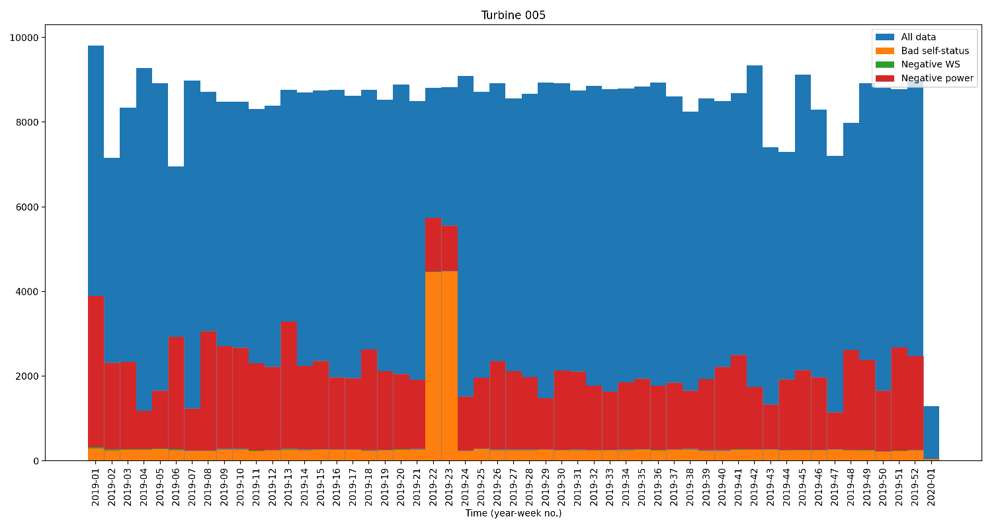
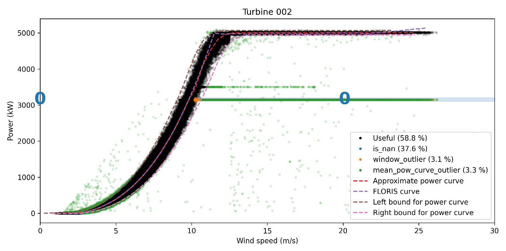
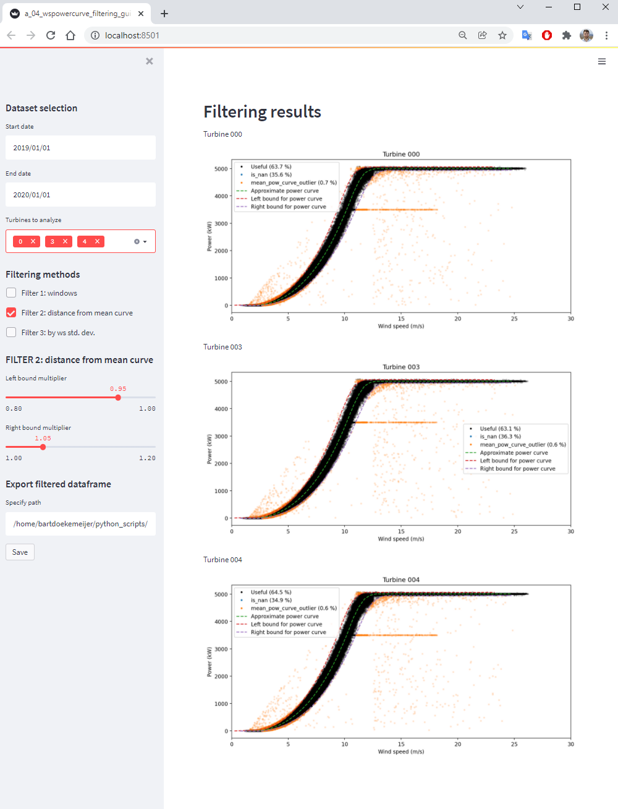
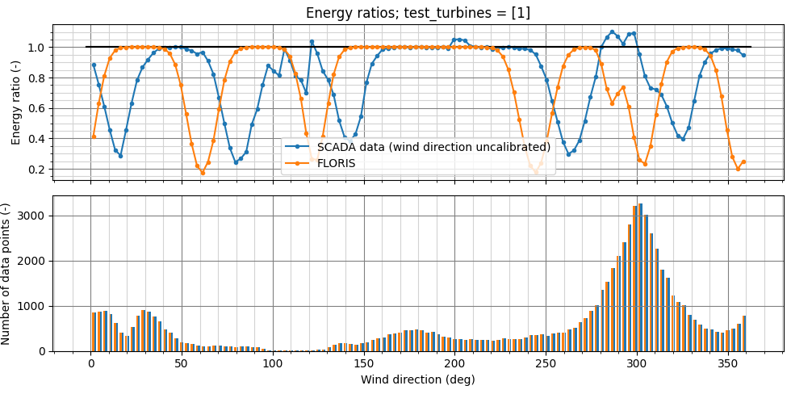
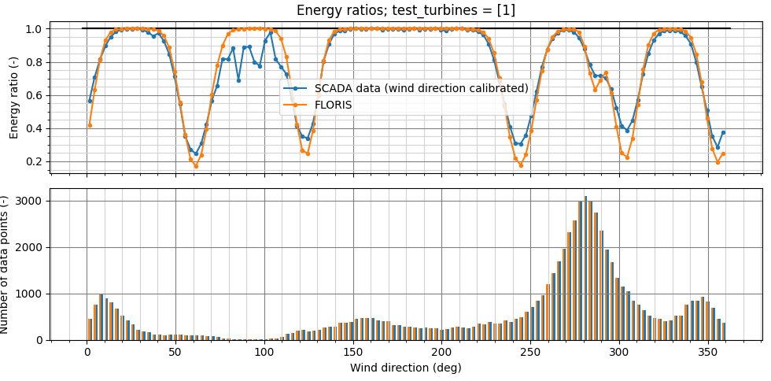

Raw data processing
-------------------

A common data preparation procedure using FLASC is as follows:

Raw data retrieval
===============================

The raw SCADA data is retrieved from an external location (e.g., FTP
server or SQL database). This step is not part of the FLASC toolbox because
it is very specific to the data location and format. It is up to the user to
download the data and format it in a Python-accessible manner (e.g., in a
.csv file).

Format data to a wide table format (if necessary)
=================================================

SCADA data can be made available in various forms. The data may already be
sampled on a common time vector, with e.g., measurements of all turbines every
10 minutes. In other situations, it may be that data is logged in a "long"
format, and where measurements are only reported if the signal has actually
changed. An example of such a data format is:

.. csv-table:: Example :rst:dir:`Tall data format for a three turbine wind farm`
   :header: "Time", "Turbine", "Variable", "Value"

   "2020-01-01 12:15:01", "A1", "NacWindSpeed", "5.5"
   "2020-01-01 12:15:01", "A2", "NacWindSpeed", "4.5"
   "2020-01-01 12:15:02", "A3", "NacWindSpeed", "7.9"
   "2020-01-01 12:15:05", "A2", "NacWindSpeed", "4.1"
   "2020-01-01 12:15:07", "A1", "NacWindSpeed", "5.9"
   "2020-01-01 12:15:11", "A3", "NacWindSpeed", "7.2"

The "long" data format is comon with high-resolution data (e.g., 1Hz), to
reduce data storage needs on the logging side. The FLASC analysis tools
require data to be in a wide table format. This means that it is up to
the user to resample the data for every wind turbine onto a common time
vector and format the data into a "wide" table format. The wide table format
looks as follows:

.. csv-table:: Example :rst:dir:`Wide data format for a three turbine wind farm`
   :header: "Time", "NacWindSpeed_A1", "NacWindSpeed_A2", "NacWindSpeed_A3"

   "2020-01-01 12:15:01", "5.5", "4.5", "7.3",
   "2020-01-01 12:15:02", "5.5", "4.5", "7.9"
   "2020-01-01 12:15:03", "5.5", "4.5", "7.9"
   "2020-01-01 12:15:04", "5.5", "4.5", "7.9"
   "2020-01-01 12:15:05", "5.5", "4.1", "5.9"

There is currently no example provided with FLASC that demonstrates the
process of data resampling and converting a long-formatted dataset to
a wide-formatted dataset. However, FLASC does provide tools to simplify
this table formatting, heavily relying on the internal functions in
the `Python Pandas library
<https://pandas.pydata.org/pandas-docs/stable/index.html>`_ for computational
efficiency.

Firstly, ``df_resample_by_interpolation()`` function allows the user to resample
a dataset which is sampled on an nonhomogeneous time vector to a time vector
with a consistent time step. This is useful, since long-formatted data is
often inconsequently sampled. One can also specify a maximum time gap for
data interpolation. If no data is available for a time period longer than
max_gap, the data will be assigned a ``NaN`` value.

 .. code-block:: python

   from flasc.time_operations import df_resample_by_interpolation
   df_res = df_resample_by_interpolation(
        df,
        time_array,
        circular_cols,
        interp_method='linear',
        max_gap=None,
        verbose=True
   )

This function also deals with 360-degree wrapping for nacelle headings and
wind direction measurements, as specified by the ``circular_cols`` option.

After each turbine's measurements are sampled onto a common time vector, they
can straightforwardly be appended into a single, wide-formatted table 
(which in Python is a ``pd.DataFrame``). A common way to format a long table
into a wide table, assuming they all share the same ``date`` vector, is:

 .. code-block:: python

    df = df.groupby(["time", "turbine", "variable"]).value.first().unstack()
    df = df.unstack()

    df.columns = ["{:s}_{:s}".format(c[0],c[1]) for c in df.columns]
    df = df.reset_index(drop=False)

or a variant of these commands.

Data filtering
==============

With the SCADA data now in a wide-formatted Pandas DataFrame, the flasc
data filtering tools can readily be applied. The files in 
``examples/raw_data_processing`` demonstrate how the SCADA data files are
processed.

++++++++++++++++++++++++
a_00_initial_download.py
++++++++++++++++++++++++

The first script, ``a_00_initial_download.py``, simply demonstrates how the raw data is imported. This
basically compromises of the previous two steps, being data downloading and
formatting it into a wide table format. Data is typically saved within flasc
using the 
`feather format <https://arrow.apache.org/docs/python/feather.html>`_, which
is known for its excellent IO speed and its efficient storage, being often a
factor 10 smaller than a similar .csv file.

+++++++++++++++++++++++++++
a_01_to_common_format_df.py
+++++++++++++++++++++++++++

The script ``a_01_to_common_format_df.py`` renames the columns in the Pandas DataFrame to the conventional
variable namings that we use within flasc. We use the following naming
convention:

- The common time vector is denoted by ``time``.
- The turbine wind speed in [m/s] is denoted by ``ws``.
- The turbine power production in [W] is denoted by ``pow``.
- The wind direction measured by each turbine, between 0 and 360 deg, is denoted by ``wd``.
- The turbine nacelle heading, between 0 and 360 deg, is denoted by ``yaw``.
- The turbine vane angle, between -180 and +180 deg, is denoted by ``vane``.

Each variable (besides ``time``) is appended with a three-digit identifier for
the turbine. For example, ``ws_000`` refers to the measured wind speed of the
first turbine in the wind farm. Out of these five variables, ``ws`` and
``pow`` are always required, and either ``wd`` or ``yaw`` is necessary for
most of the energy ratio analyses.

+++++++++++++++++++++
a_02_basic_filters.py
+++++++++++++++++++++

The script ``a_02_basic_filters.py`` identifies obvious data outliers. The criteria for this are
assigned by ``conds``. The example file assigns the following conditions as
being obviously faulty:

 .. code-block:: python

    conds = [
        ~df["is_operation_normal_{:03d}".format(ti)],
        df["ws_{:03d}".format(ti)] <= 0.0,
        df["pow_{:03d}".format(ti)] <= 0.0,
    ]

where the column ``is_operation_normal_000`` would refer to a turbine's
self-reported signal that identifies its operational state as normal or not.
Further, negative wind speed and power measurements are identified as faulty.
The script will also plot the timestamps for which the faulty conditions
are met. For example, the figure below shows two weeks in which the turbine
flagged a lot of its own operation as faulty, being the 22nd and 23rd week
of 2019:

+++++++++++++++++++++++++++++++++
a_03_check_sensor_stuck_faults.py
+++++++++++++++++++++++++++++++++

The script ``a_03_check_sensor_stuck_faults.py`` detects sensor-stuck type of faults. These are faults in which
the sensor reports the exact same value for an unrealistically long period
of time. For example, if the reported vane angle is exactly 14.33 deg for
5 consecutive minutes, it is obvious that this measurement cannot be trusted.
Though that not all measurements are valid for a sensor-stuck-type-of-fault
check. Namely, the nacelle heading is a more discrete signal and often
points in the same direction for longer periods of time. Therefore, the
signals to check this fault for must be carefully selected. Good signals
for this are ``ws`` and ``vane``. The signals are selected in the
``column_list`` variable.

++++++++++++++++++++++++++++++
a_04_wspowercurve_filtering_code.py
++++++++++++++++++++++++++++++

The script ``a_04_wspowercurve_filtering_code.py`` is a fairly exhaustive
filtering class that can identify the nominal turbine wind-speed power curve
and remove outliers. Outliers can be simply faulty sensor measurements, but
can also be periods of curtailment and periods of turbine maintenance.

There are two main ways of detecting and removing outliers. The first method
is by adding "windows" in which measurements must be located. This can be
done by:

 .. code-block:: python

    ws_pow_filtering.window_add(
        ws_range=[0.0, 10.2],
        pow_range=[3100.0, 3200.0],
        axis=0,
        turbines="all",
    )

Within the ``window_add`` function, one specifies the wind speed and power
production range in which measurements are valid. Any measurements outside
of this range is faulty. The ``axis`` option defines in which direction the
window outliers are enforced. For example, with ``axis=0``, any measurements
within the power production range but outside of the wind speed range are
classified as faulty. Similarly, with ``axis=1``, any measurements within the
wind speed range but outside the power production range are classified as
faulty and removed.

The second method for data filtering is by looking at the deviation of
measurements in comparison to the nominal power curve. This filtering method
is enforced by the ``ws_pow_filtering.filter_by_power_curve()`` function.
In the figure above, the allowable deviations from the median power curve
are denoted in the brown and pink dashed line.

++++++++++++++++++++++++++++++
a_04_wspowercurve_filtering_gui.py (optional)
++++++++++++++++++++++++++++++

The script ``a_04_wspowercurve_filtering_gui.py`` is a GUI front for the
windspeed-power curve filtering class, and is for comparable usage as the
``a_04_wspowercurve_filtering_code.py`` script. Both functions serve the
same function and thus typically this script (``_gui.py``) can be ignored
in the filtering process. Generally, we strongly recommend users to use
``a_04_wspowercurve_filtering_code.py`` instead of
``a_04_wspowercurve_filtering_gui.py`` for any real data processing.

This script should be run by:

 .. code-block:: bash

    streamlit run a_04_wspowercurve_filtering_gui.py

Using this GUI, the user can analyze specific turbines, interactively add or
remove filter windows, and adjust settings to the filtering method based on
deviations from the median power curve. The user can also analyze specific
time periods of the data to speed up computations and plotting. Finally, it
is important to note that the user should set the ``Turbines to analyze`` to
``all``, in case the filtered dataframe is to be exported and saved locally.

.. warning::

   For most applications, we recommend you to use the
   ``a_04_wspowercurve_filtering_code.py`` as it has gone through more tests and
   usage. The streamlit app is useful for exploring the options within the
   windspeed-power curve filtering class, but its not recommend for widespread
   usage.

+++++++++++++++++++++++++++++++++++++++++++
a_05a_plot_faults_with_layout.py (optional)
+++++++++++++++++++++++++++++++++++++++++++
The script ``a_05a_plot_faults_with_layout.py`` is not functional, but
primarily informative. It plots the turbine locations and colors them based on
their ratio of valid vs. invalid measurements. This allows the user to
identify any turbines that have a significantly higher percentage of faulty
measurements than others. This could point towards operational issues or
prolonged maintenance periods.

+++++++++++++++++++++++++++++++++++++++++++++++++++++++++++++
a_05b_cross_compare_wd_measurement_calibrations.py (optional)
+++++++++++++++++++++++++++++++++++++++++++++++++++++++++++++
The script ``a_05b_cross_compare_wd_measurement_calibrations.py`` cuts the
data up into different time periods, in the order of weeks to months, and then
cross-compares the wind direction measurements. The average difference in deg
between the wind directions (or nacelle headings) are estimated. This is often
nonzero since turbines are often not calibrated to true north. However, their
relative offset should be constant over time, if their calibrations are not
reset or changed during the measurement period. For each data slice, the
offsets between turbines' wind direction signals are calculated. If the
offsets do not change over time, their northing calibrations are consistent
and their wind direction measurements are useable for further analysis.
If the offset between turbines' wind directions change over time, the northing
calibrations for one or both turbines are inconsistent and therefore their
measurements cannot be trusted.

This script produces a figure that shows the turbine layouts and colors
the turbines according to their northing calibration validity: either being
valid (green), uncertain (orange), or confirmed invalid (red).

+++++++++++++++++++++++++++++++++++++++++++++++++++
a_06a_determine_timeshift_datasources.py (optional)
+++++++++++++++++++++++++++++++++++++++++++++++++++
If we have measurements available from multiple sources, such as both SCADA
data from turbines and from an operational met mast, we first need to make
sure these datasets are time synchronized. We can do that with the script
``a_06a_determine_timeshift_datasources.py``. Based on a commonly measured
variable such as the wind direction, this script finds the optimal timeshift
such that the two signals show maximum agreement (using the Pearson
correlation coefficient). Often, time shifts between dataframes are a round
number of hours, being due to different measurement equipment using different
timezones for their internal clock.

In our example, turbine 3 is positioned close to the met mast. Therefore,
we estimate the timeshift between the datasets using one signal of
turbine 3 and a comparable signal of the met mast. Here, that signal is the
wind direction, which should be comparable between the two turbines.
Note that we have not yet calibrated the turbine's wind direction to
true north, so we may have an offset anywhere between -180 and +180 deg
compared to the met mast signal. The algorithm in 
``a_06a_determine_timeshift_datasources.py`` accommodates for that by
calculating and subtracting the mean difference in wind directions over
the entire time period. The assign the measurement(s) to compare in
``scada_cols`` for the turbine-measured values, and ``metmast_cols``
for the external measurements, respectively. If these variables are
angles that wrap around 360 degrees, then we must set
``circular_stats=True``.

 .. code-block:: python

    scada_cols = ["wd_003"]
    metmast_cols = ["WindDirection_80m"]
    circular_stats = True

+++++++++++++++++++++++++++++++++++++++
a_06b_apply_timeshift_dfs.py (optional)
+++++++++++++++++++++++++++++++++++++++
The optimal time shift found in ``a_06a_determine_timeshift_datasources.py``
is used in this script to shift the time vector of one of the two dataframes
so that they are synchronized with the other dataframe. 

+++++++++++++++++++++++++++++++++++++
a_07a_estimate_wd_bias_per_turbine.py
+++++++++++++++++++++++++++++++++++++
The script ``a_07a_estimate_wd_bias_per_turbine.py`` is used for northing
calibration of every turbine's wind direction measurement to true north.
What we do here is that we compare the energy ratios over the entire
wind rose against the energy ratios predicted by the floris wake model.
We evaluate the difference between the measured and modeled energy ratio curves
for different biases, between -180 deg and +180 deg, and then find the
offset required on the SCADA-based wind directionm signal that best aligns
the energy ratios. This is comparable to aligning the angles at which the
largest wake deficit occurs, which is the common method in the literature,
yet more inclusive since it considers all wake interactions over the wind
rose for the northing calibration. Here are the energy ratio curves
prior to northing calibration:

After evaluating a large range of possible bias corrections on the wind
direction signal of a turbine, we find the value which best aligns the
energy ratios. The energy ratios with the calibrated wind direction
signal are shown in the next figure:

Note that this method can be used for each turbine individually. However,
a simpler and faster method exists: once the first turbine's wind
direction has been calibrated to true north, it is fairly easy to calibrate
the other turbine's signals to this first turbine. Namely, we can estimate
the average difference between the wind direction signals of the calibrated
turbine and any other (uncalibrated) turbine, and that becomes the bias
correction that the turbine needs. We can determine the shift between
two turbine's wind direction signals using the ``match_y_curves_by_offset``
function, as demonstrated in the example script 
``a_07a_estimate_wd_bias_per_turbine.py``.

For more information how the subtleties about calculating the energy ratio,
and the various lower-level choices that must be made to do so, please see
the example and documentation surrounding the energy ratio analysis suite.

++++++++++++++++++++++
a_07b_wd_bias_to_df.py
++++++++++++++++++++++
The script ``a_07b_wd_bias_to_df.py`` takes the wind direction bias correction
terms estimated in ``a_07a_estimate_wd_bias_per_turbine.py`` and applies them
on the SCADA dataset. Each of the ``wd_000``, ``wd_001``, ``wd_...`` columns
in the dataframes are now northing calibrated. Note that the example script
only applies the northing corrections to the wind direction signals. If the
dataset also contains turbine nacelle headings (i.e., ``yaw_000``,
``yaw_001``, ``yaw_...``), then the same correction terms must be applied
to these columns.

++++++++++++++++++++++++++
a_08_plot_energy_ratios.py
++++++++++++++++++++++++++
The script ``a_08_plot_energy_ratios.py`` plots the energy ratios after
calibration. It produces the most recent figure shown above, and repeated
below for completeness. For more
information how the subtleties about calculating the energy ratio,
and the various lower-level choices that must be made to do so, please see
the example and documentation surrounding the energy ratio analysis suite.

.. seealso:: `Return to table of contents <index.html>`_ 